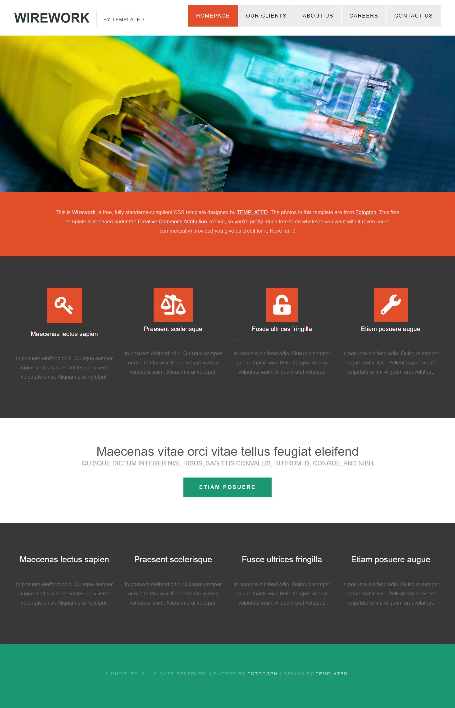

# HTML CSS Practice Repo

This repo provides fundamentals knowledge of web technologies HTML and CSS. Basic knowledge in web development, web browsers, HTML / CSS / DOM development tools and develop practical skills in using the language for describing web content - HTML - and the language for styling web content - CSS and also takes a deeper look at modern fron-end design and development

## Wirework Landing Page

